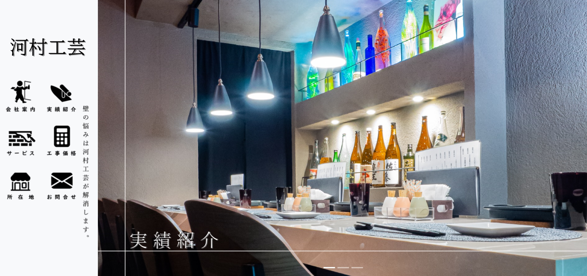

# 家業のCMS付ホームページです

実績紹介のページは、CMSで管理しています。

文字や画像の登録を行うだけで実績ページの作成が可能です。

# 使い方

**１.管理者画面を開く**

　画面最下部にあるログインより管理者画面に移ってください。
 
　http://kakunin-kougei.herokuapp.com/login より直接ログイン画面に移動できます。

　　メールアドレス： test@yahoo.co.jp
 
　　パスワード　　： test1234
 
**２.管理画面一覧より希望するページへ移動してください**
 
**３.新規実績登録画面**

　見出し・施工期間は、画像の上に表示されている文字になります。
 
　以降は、入力欄と表示順序が対応しています。
 
　画像のアップロードは、赤文字 最大1MBとしてください。
 
　※新規実績登録後は、自動で実績変更選択画面へ移動します。

 
**４.実績変更選択画面**

　内容修正する実績を選択してください。
 
　新規実績登録された物件は、実績一覧の2番目に非表示としてDBに登録されています。
 
　登録されたレイアウトの確認は、以下のアドレスより行ってください。
 
　*http://kakunin-kougei.herokuapp.com/work/index?priority=2*
　
 
　レイアウトに問題が無ければ、登録された実績変更ページに移動し、「表示切替」「表示順序」を変更してください。
 
　※内容変更をする場合、写真を再登録する必要があります。
 
 　 Heroku使用時に画像はbase64エンコードとしてDBに保存する必要があるため、不具合が発生しています。
   
  　シンボリックリンクが使用できる場合は、写真の再登録の必要はありません。
   
**５.お願い**

　動作確認のため新規実績登録を行った場合は確認後、登録実績の削除をお願いします。
 
　
　現在、登録されている実績の変更は行わないでください。

## Laravel Sponsors

We would like to extend our thanks to the following sponsors for funding Laravel development. If you are interested in becoming a sponsor, please visit the Laravel [Patreon page](https://patreon.com/taylorotwell).

### Premium Partners

- **[Vehikl](https://vehikl.com/)**
- **[Tighten Co.](https://tighten.co)**
- **[Kirschbaum Development Group](https://kirschbaumdevelopment.com)**
- **[64 Robots](https://64robots.com)**
- **[Cubet Techno Labs](https://cubettech.com)**
- **[Cyber-Duck](https://cyber-duck.co.uk)**
- **[Many](https://www.many.co.uk)**
- **[Webdock, Fast VPS Hosting](https://www.webdock.io/en)**
- **[DevSquad](https://devsquad.com)**
- **[Curotec](https://www.curotec.com/services/technologies/laravel/)**
- **[OP.GG](https://op.gg)**
- **[WebReinvent](https://webreinvent.com/?utm_source=laravel&utm_medium=github&utm_campaign=patreon-sponsors)**
- **[Lendio](https://lendio.com)**

## Contributing

Thank you for considering contributing to the Laravel framework! The contribution guide can be found in the [Laravel documentation](https://laravel.com/docs/contributions).

## Code of Conduct

In order to ensure that the Laravel community is welcoming to all, please review and abide by the [Code of Conduct](https://laravel.com/docs/contributions#code-of-conduct).

## Security Vulnerabilities

If you discover a security vulnerability within Laravel, please send an e-mail to Taylor Otwell via [taylor@laravel.com](mailto:taylor@laravel.com). All security vulnerabilities will be promptly addressed.

## License

The Laravel framework is open-sourced software licensed under the [MIT license](https://opensource.org/licenses/MIT).
